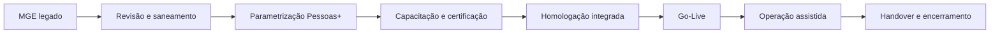
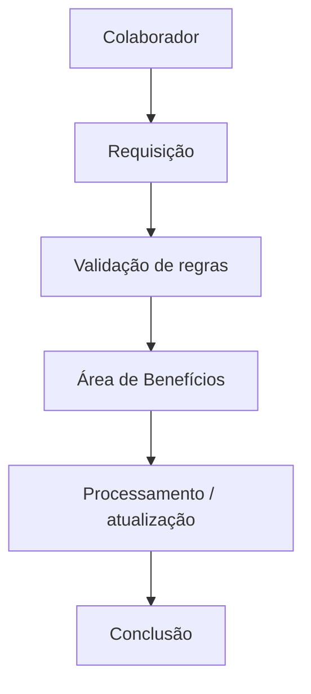
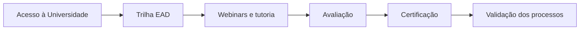
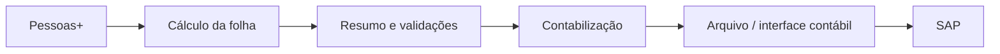
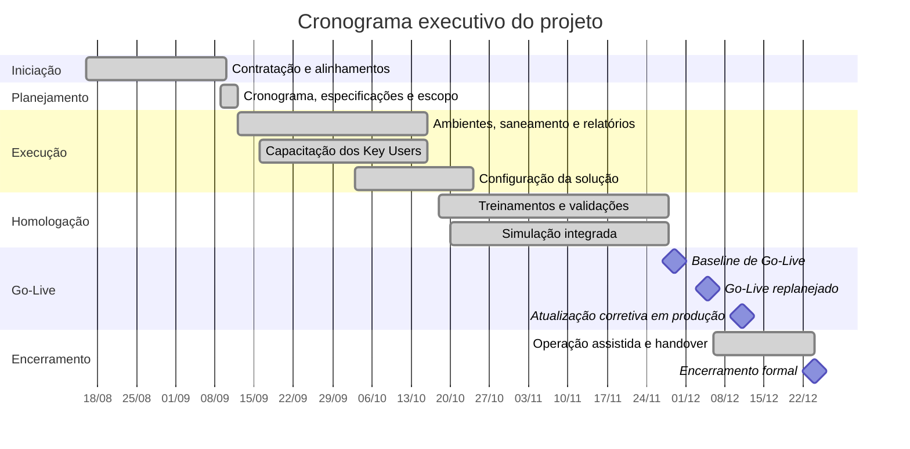
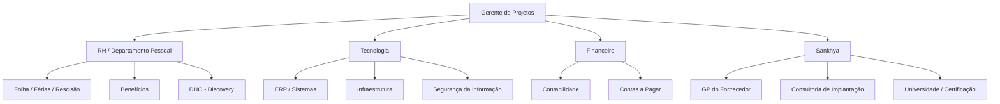

# Migração da Folha de Pagamento para Sankhya Pessoas+

### Case de Gerenciamento de Projetos | Enterprise Systems | ERP/HCM | Gestão de Pessoas | Migração de Sistemas

**Gerente de Projetos:** João Henrique Gusmão Esteves  
**Período formal do projeto:** 16/08/2024 a 24/12/2024  
**Abordagem:** Preditiva, com homologações iterativas e replanejamento controlado

> **Confidencialidade:** este case foi reconstruído para fins de portfólio. O nome da empresa cliente, nomes de colaboradores, e-mails, telefones, CNPJs, IDs de chamados e documentos, valores comerciais, códigos internos, unidades operacionais e demais informações sensíveis foram removidos ou generalizados. Os nomes **Sankhya**, **Pessoas+**, **MGE**, **eSocial** e **SAP** foram mantidos por representarem tecnologias e produtos de mercado relevantes ao contexto técnico do projeto.

---

## Visão Geral do Projeto

| Indicador | Resultado |
| :--- | :---: |
| Sistema de origem | **MGE (legado)** |
| Solução de destino | **Sankhya Pessoas+** |
| Workstreams principais | **Pessoal+ · eSocial · Gestão Pessoas+ · Pessoas+ App** |
| Key Users formalmente certificados | **2** |
| Status Reports registrados | **12 ciclos** |
| Baseline de Go-Live | **29/11/2024** |
| Go-Live replanejado | **05/12/2024** |
| Desvio registrado no Go-Live | **4 dias úteis** |
| Handover para Service Desk | **Concluído** |
| Encerramento formal | **Escopo integral encerrado em 24/12/2024** |

*Informações comerciais e dados identificáveis da organização foram propositalmente omitidos.*

---

## Contexto e Desafio

O projeto teve como objetivo migrar a operação de **folha de pagamento de um ambiente legado MGE para o Sankhya Pessoas+**, modernizando a execução dos processos de Departamento Pessoal e ampliando o uso de recursos digitais voltados a colaboradores e lideranças.

O escopo envolveu rotinas críticas como:

- registro e movimentação de colaboradores;
- folha mensal, adiantamento e 13º salário;
- férias e rescisões;
- afastamentos, cargos e salários;
- eSocial;
- contabilização da folha e provisões;
- Painel de Liderança;
- Pessoas+ App;
- processos de benefícios;
- capacitação e certificação de usuários-chave.

### Principal desafio gerencial

A implantação não era apenas uma troca de sistema. O projeto dependia de **certificação obrigatória de Key Users**, revisão de processos legados, saneamento de eventos, validação de relatórios, preparação dos ambientes, homologação de dezenas de rotinas e coordenação entre RH/DP, Tecnologia, Contabilidade, Financeiro e fornecedor.

Durante a execução também surgiram gaps funcionais e necessidades adicionais próximas ao Go-Live, exigindo replanejamento, agendas extras de homologação e gestão formal de mudança.

---

## Meu Papel como GP

Atuei como **Líder do Projeto / Gerente de Projetos pelo cliente**, sendo o ponto de integração entre negócio, Tecnologia e a equipe de implantação da Sankhya.

Minha atuação incluiu:

- planejamento e manutenção do cronograma integrado;
- condução do Kick-off interno e alinhamentos com o fornecedor;
- coordenação dos Key Users e responsáveis por processo;
- acompanhamento da trilha de capacitação e certificação;
- gestão de riscos, dependências, pendências e mudanças de escopo;
- elaboração e condução dos Status Reports;
- acompanhamento de acessos, ambientes e atualizações necessárias à implantação;
- coordenação das etapas de configuração, auditoria, treinamento e homologação;
- gestão dos gaps funcionais e chamados do fornecedor próximos ao Go-Live;
- organização das agendas adicionais de validação;
- condução da governança de mudança para produção;
- acompanhamento da operação assistida;
- coordenação do handover para Service Desk;
- encerramento formal do projeto.

---

## Escopo Funcional e Workstreams

### Pessoal+

Principais processos tratados no projeto:

- cadastro de colaboradores e dependentes;
- registros ocupacionais aplicáveis;
- movimentação de colaboradores;
- alterações de cargos e salários;
- afastamentos e transferências;
- cálculo de folha normal;
- adiantamentos;
- 13º salário;
- férias;
- rescisões;
- regras e fórmulas de cálculo;
- contabilização da folha e provisões.

### eSocial

A implantação contemplou preparação, configuração, testes e homologação do processo de **eSocial**, integrado às informações geradas pelas rotinas de pessoal.

### Gestão Pessoas+ e Painel de Liderança

O projeto também tratou funcionalidades direcionadas às lideranças, como requisições, consultas e análises de equipe, além do **Painel de Liderança**.

### Pessoas+ App

O aplicativo foi incluído como canal de acesso do colaborador a informações e serviços, como documentos, dados relacionados à folha e requisições aplicáveis.

---

## Benefícios

Benefícios constituiu um workstream específico durante a implantação, com configuração e homologação de cenários relacionados a:

- plano de saúde e odontológico;
- vale-alimentação/refeição;
- vale-transporte;
- dependentes;
- fluxos de requisição;
- cenários de **flex office**, férias e afastamentos.

A complexidade surgiu principalmente porque regras de benefícios dependiam da situação do colaborador e do calendário de trabalho, exigindo testes adicionais e ajustes próximos ao Go-Live.

---

## DHO — Discovery de Evolução

Durante a execução também foi realizado um **levantamento adicional de requisitos com DHO**, envolvendo oportunidades como:

- automatização de onboarding;
- acompanhamento de treinamentos;
- dados de escolaridade e certificações;
- movimentações internas;
- histórico de feedbacks e avaliações;
- acompanhamento de desempenho;
- rastreabilidade de candidaturas internas.

> **Importante:** a documentação disponível comprova o levantamento e a análise dessas necessidades, mas não comprova a implantação integral de todos esses itens dentro do projeto encerrado. Por isso, este case os registra como **discovery/evolução avaliada**, e não como entregas concluídas.

---

## Capacitação e Certificação dos Key Users

A metodologia do fornecedor estabelecia a certificação de usuários-chave como dependência para o avanço da implantação.

Essa dependência foi tratada como parte do caminho crítico do projeto, porque a ausência de certificação poderia bloquear etapas posteriores de validação e execução.

Ao final, o encerramento formal registrou **2 Key Users certificados** para os produtos implantados.

---

## Migração e Preparação Técnica

A preparação dos ambientes incluiu atividades de infraestrutura e aplicação necessárias para permitir a configuração e homologação da nova solução.

Entre as frentes acompanhadas estavam:

- liberação de acessos para consultoria;
- atualização dos ambientes Sankhya/Pessoas+;
- criação de base de testes atualizada;
- saneamento de eventos de folha;
- revisão de relatórios existentes no MGE;
- análise de permissões;
- validação de campos adicionais;
- preparação de relatórios e informações necessárias à operação.

Um ponto relevante foi que parte dos relatórios formatados do ambiente legado não era diretamente compatível com o Pessoas+, exigindo revisão e tratamento específico.

---

## Contabilização da Folha

A implantação envolveu também o fluxo de **contabilização da folha e provisões**, com validação entre Departamento Pessoal, Sistemas e Contabilidade.

A integração financeira nativa não foi apresentada como entrega aplicável no encerramento; o foco documentado foi a **contabilização da folha/provisões e a validação dos dados contábeis**.

---

## Cronograma Executivo Anonimizado

O cronograma original possuía detalhamento por atividade, responsável, datas planejadas e realizadas. Para o portfólio, ele foi reduzido a uma visão executiva, mantendo apenas fases e marcos relevantes.

### Leitura gerencial do cronograma

O Go-Live possuía baseline em **29/11/2024**. Próximo à entrada em produção, gaps funcionais e necessidades de correção exigiram extensão da homologação e o marco foi replanejado para **05/12/2024**, com **4 dias úteis de desvio registrados**.

Em **11/12/2024**, uma mudança controlada em produção atualizou o módulo para tratar gaps remanescentes. O encerramento e a transferência formal para sustentação foram concluídos em **24/12/2024**.

---

## Governança e Artefatos

O projeto utilizou diferentes mecanismos de governança para controlar escopo, prazo, riscos, qualidade e transição para operação.

| Artefato / prática | Aplicação no projeto |
| :--- | :--- |
| Kick-off | Alinhamento de escopo, papéis, riscos e cronograma |
| Cronograma integrado | Planejamento e acompanhamento de atividades e marcos |
| Status Report | 12 ciclos documentados de acompanhamento executivo |
| Matriz de equipe | Definição de sponsor, GP, técnico, Key Users e apoiadores |
| Trilha de certificação | Gate para validação dos processos |
| Homologação integrada | Validação funcional antes da produção |
| Gestão de gaps | Acompanhamento de chamados e correções do fornecedor |
| GMUD | Controle formal da alteração em produção |
| Operação assistida | Suporte à estabilização pós-Go-Live |
| Termo de Encerramento | Formalização da conclusão integral do escopo |
| Handover para Service Desk | Transferência formal para sustentação |

---

## Stakeholders e Áreas Envolvidas

Os nomes individuais foram removidos do case. A governança original possuía responsáveis específicos por processo e usuários-chave para validação das rotinas críticas.

---

## Gestão de Riscos e Gaps

Os riscos acompanhados desde o início incluíam:

- atraso em aprovações e validações;
- indisponibilidade de Key Users;
- não conclusão da certificação no prazo;
- alteração de escopo;
- processos não identificados no levantamento inicial;
- necessidade de ajustes em relatórios legados;
- gaps funcionais identificados durante homologação.

Próximo ao Go-Live, o projeto também precisou tratar ocorrências relacionadas a:

- regras de rescisão e aviso prévio;
- provisões de férias;
- requisições de admissão;
- permissionamento de usuários;
- processamento de benefícios em cenários específicos;
- entrega e velocidade de e-mails do sistema.

### Respostas adotadas

- ampliação das agendas de homologação;
- inclusão de consultoria adicional em etapas críticas;
- replanejamento do Go-Live;
- utilização de solução temporária para uma necessidade de relatório;
- abertura e acompanhamento formal de gaps com o fornecedor;
- mudança controlada de versão em produção;
- agendas pós-Go-Live e operação assistida.

---

## Go-Live e Transição para Operação

Antes da entrada em produção, foi executada uma **simulação integrada dos processos**, cobrindo os principais fluxos do Pessoas+, eSocial e aplicativo.

A preparação para produção incluiu validações relacionadas a:

- cadastros de colaboradores e dependentes;
- regras de cálculo;
- histórico de férias;
- folha mensal, adiantamentos, férias, rescisões e 13º;
- ficha financeira;
- arquivos e obrigações aplicáveis;
- relatórios;
- integração com o Pessoas+ App.

Após o Go-Live, o projeto seguiu para operação assistida, estabilização e transferência formal do atendimento para o **Service Desk da Sankhya**.

---

## Resultados

O Termo de Encerramento registrou a conclusão do **projeto completo, com integralidade do escopo aplicável**, após parametrização, homologação, simulação e entrada em produção.

### Resultados consolidados

- migração da operação de folha do ambiente legado para o **Sankhya Pessoas+**;
- processos de cadastro e movimentação de colaboradores homologados;
- folha normal, adiantamento, férias, rescisões e 13º homologados;
- contabilização da folha e provisões homologada;
- eSocial implantado e homologado;
- Pessoas+ App implantado;
- Painel de Liderança disponibilizado;
- Key Users certificados;
- tratamento de processos de benefícios durante a implantação;
- Go-Live realizado após replanejamento controlado;
- operação assistida executada;
- handover formal para Service Desk;
- encerramento integral do projeto.

> O projeto demonstra principalmente a capacidade de **conduzir uma migração de sistema corporativo crítico, coordenando pessoas, fornecedor, capacitação, homologação, riscos e mudança de produção sem perder rastreabilidade e governança**.

---

## Lições Aprendidas

1. **Tratar a certificação dos Key Users como caminho crítico.** Dependências de capacitação podem bloquear fases posteriores da implantação.
2. **Detalhar requisitos antes da configuração.** Processos descobertos tardiamente geram change requests, customizações e pressão sobre o Go-Live.
3. **Mapear explicitamente os relatórios do legado.** Nem todo artefato operacional existente será compatível com a nova solução.
4. **Reservar capacidade para homologação e correção de gaps.** Projetos de ERP/HCM exigem ciclos de teste suficientes antes da entrada em produção.
5. **Manter usuários de negócio efetivamente disponíveis.** A presença dos Key Users é essencial para validar regras que a equipe técnica não pode decidir isoladamente.
6. **Formalizar mudanças próximas ao Go-Live.** A GMUD e os testes pós-implementação reduziram o risco da atualização corretiva em produção.
7. **Planejar a transição para sustentação.** Operação assistida e handover evitaram que o encerramento administrativo ocorresse antes da estabilização operacional.

---

## Tecnologias, Métodos e Disciplinas

  
  
  
  
  
  
  
  

---

## Sobre este Case

Este repositório apresenta uma **reconstrução profissional e anonimizada** de um projeto concluído em 2024. A documentação corporativa original permanece fora do GitHub e foi utilizada apenas como fonte factual para reconstrução do case.

O objetivo não é reproduzir documentos internos, mas demonstrar **como uma migração de ERP/HCM foi planejada, governada, homologada, replanejada, colocada em produção e formalmente encerrada**.

**João Henrique Gusmão Esteves**  
Gerenciamento de Projetos de Tecnologia | PMO | Transformação Digital

